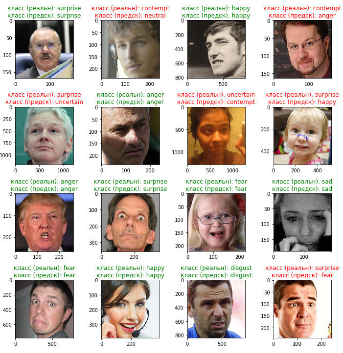

# Классификатор эмоций
 

### Описание
 
Проект посвящен созданию модели для классификации человеческих эмоций по изображению лица. 
В качестве базового фреймворка используется TensorFlow 2.3.0 и Keras. 
Ввиду ограниченности локальных ресурсов все эксперименты проводились на платформе Google Colab, поэтому было решено строить классификатор на предобученной модели. Были выбраны 3 модели из Top-1 Accuracy Keras Applications:
  
* ResNet50
* VGG16
* Xception
 

От базовых моделей отрезались финальные (конечные) слои, которые используются для предсказания они заменялись на слой для предсказания класса эмоций, все слои, кроме последних блоков со сверточными слоями, «замораживались» для обучения. 
Были проведены следующие эксперименты: 

| **№ Эксперимента** | **Дата** | **Базовая модель** | **Дополнительные слои**                                                                                                                                                                                                                        | **Оптимизатор**                                            | **Loss**                    | **Аугментация** | **Количество эпох** | **Точность на валидации** | **Кривая обучения**                                                                         |
| ------------------ | -------- | ------------------ | ---------------------------------------------------------------------------------------------------------------------------------------------------------------------------------------------------------------------------------------------- | ---------------------------------------------------------- | --------------------------- | --------------- | ------------------- | ------------------------- | ------------------------------------------------------------------------------------------- |
| 1                  | 19.12.20 | resnet50           | tf.keras.layers.Flatten(), tf.keras.layers.Dense(1024, activation='relu'), tf.keras.layers.Dense(p\_num\_classes, activation='softmax')                                                                                                     | tf.keras.optimizers.SGD(learning\_rate=0.01, momentum=0.9) | 'categorical\_crossentropy' | нет             | 10                  | 34                        |                                                                                             |
| 2                  | 22.12.20 | vgg16              | tf.keras.layers.Flatten(), tf.keras.layers.Dense(512, activation='relu'), tf.keras.layers.Dense(p\_num\_classes, activation='softmax')\]                                                                                                 | tf.keras.optimizers.SGD(learning\_rate=0.01, momentum=0.9) | 'categorical\_crossentropy' | нет             | 10                  | 14                        |                                                                                             |
| 4                  | 23.12.20 | Xception           | tf.keras.layers.Flatten(), tf.keras.layers.Dense(1024, activation='relu'), tf.keras.layers.Dense(p\_num\_classes, activation='softmax')                                                                                                     | tf.keras.optimizers.SGD(learning\_rate=0.01, momentum=0.9) | 'categorical\_crossentropy' | нет             | 10                  | 34                        |                                                                                             |
| 5                  | 24.12.20 | Xception           | tf.keras.layers.Flatten(), tf.keras.layers.Dense(1024, activation='relu'), tf.keras.layers.Dense(p\_num\_classes, activation='softmax')                                                                                                     | tf.keras.optimizers.SGD(learning\_rate=0.01, momentum=0.9) | 'categorical\_crossentropy' | да              | 10                  | 32                        |                                                                                             |
| 6                  | 25.12.20 | Xception           | tf.keras.layers.GlobalAveragePooling2D(), tf.keras.layers.Dropout(0.2), tf.keras.layers.Dense(p\_num\_classes, activation='softmax')                                                                                                     | tf.keras.optimizers.Adam(learning\_rate=0.001)             | 'categorical\_crossentropy' | да              | 10                  | 31                        |                                                                                             |
| 7                  | 27.12.20 | Xception           | tf.keras.layers.GlobalAveragePooling2D(), tf.keras.layers.Dropout(0.2), tf.keras.layers.Dense(p\_num\_classes, activation='softmax')                                                                                                     | tf.keras.optimizers.Adam(learning\_rate=0.001)             | 'categorical\_crossentropy' | да              | 15                  | 31                        |                                                                                             |
| 8                  | 28.12.20 | Xception           | tf.keras.layers.GlobalAveragePooling2D(), tf.keras.layers.Dropout(0.5), tf.keras.layers.Dense(512, activation='relu'), tf.keras.layers.Dense(128, activation='relu'), tf.keras.layers.Dense(p\_num\_classes, activation='softmax') | tf.keras.optimizers.Adam(learning\_rate=0.01)              | 'categorical\_crossentropy' | да              | 17                  | 26                        |                                                                                             |
| 9                  | 30.12.20 | Xception           | tf.keras.layers.GlobalAveragePooling2D(), tf.keras.layers.Dropout(0.2), tf.keras.layers.Dense(1024, activation='relu'), tf.keras.layers.Dense(p\_num\_classes, activation='softmax')                                                  | tf.keras.optimizers.SGD(learning\_rate=0.01, momentum=0.9) | 'categorical\_crossentropy' | да              | 20                  | 34                        |                                                                                             |
| 10                 | 03.01.21 | resnet50           | f.keras.layers.GlobalAveragePooling2D(), tf.keras.layers.Dropout(0.2), tf.keras.layers.Dense(1024, activation='relu'), tf.keras.layers.Dense(p\_num\_classes, activation='softmax')                                                   | tf.keras.optimizers.SGD(learning\_rate=0.01, momentum=0.9) | 'categorical\_crossentropy' | да              | 20                  | 33                        |                                                                                             |
| 11                 | 04.01.21 | resnet50           | f.keras.layers.GlobalAveragePooling2D(), tf.keras.layers.Dropout(0.2), tf.keras.layers.Dense(1024, activation='relu'), tf.keras.layers.Dense(p\_num\_classes, activation='softmax')                                                   | tf.keras.optimizers.SGD(learning\_rate=0.01, momentum=0.9) | 'categorical\_crossentropy' | да              | 40                  | 34                        |                                                                                             |
| 12                 | 05.01.21 | resnet50           | Разморожены слои из блока «conv5» базовой модели tf.keras.layers.GlobalAveragePooling2D(), tf.keras.layers.Dense(p\_num\_classes, activation='softmax')                                                                                  | tf.keras.optimizers.SGD(learning\_rate=0.01, momentum=0.9) | 'categorical\_crossentropy' | да              | 20                  | 44                        |  |

Лучший результат: 44% точности на валидации показал классификатор на базе **ResNet50**. Для модели применялся оптимизатор *optimizer= tf.keras.optimizers.SGD(learning_rate=LEARNING_RATE, momentum=0.9)*. 
Модель обучалась 20 эпох, лучшее значение было получено на 16 эпохе, после чего началось переобучение модели. При обучении к данным применялась аугментация «на лету» со следующими параметрами:

* horizontal_flip=True,
* zoom_range=0.2,
* height_shift_range=0.2,
* width_shift_range=0.2,
* rotation_range=15
  

### Структура проекта

      data/                               исходные и тестовые данные, словари
      model/                              сохраненные модели по результатом каждого эксперимента
      images/                             картинки для описания проекта
      emo_classificator_prep_data.ipynb   ноутбук для подготовки аугментированного набора данных для обучения классификатора эмоций
      emo_classificator_test.ipynb        ноутбук для проверки и тестирования классификатора эмоций
      emo_classificator_train.ipynb       ноутбук для создания и обучения классификатора эмоций
      emo_utils.py                        базовые функции 
      experiments.xls                     таблица с описанием проведенных экспериментов 

### Запуск

1. Скачайте исходный набор данных: 'https://drive.google.com/uc?id=1pm86O0t_0caQq3b3Qz5iNI3T77p2o-C1'
2. Распакуйте в папку **data**, в итоге должна получиться следующая структура:

|-data 
&nbsp;&nbsp;&nbsp;|---train 
&nbsp;&nbsp;&nbsp;&nbsp;&nbsp;|---anger 
&nbsp;&nbsp;&nbsp;&nbsp;&nbsp;|---... 

3. Для обучения классификатора эмоций выполните код из ноутбука **emo_classificator_train.ipynb**, настроив параметры стреды и обучения:

4. Для теста классификатора эмоций используйте ноутбук **emo_classificator_test.ipynb **,  в качестве параметра задайте путь к сохраненной модели из папки models
5. Не обязательно. Для ускорения обучения можно предварительно сгенерироровать аугментированный набор данных. Для этого выполните код из ноутбука **emo_classificator_prep_data.ipynb**
